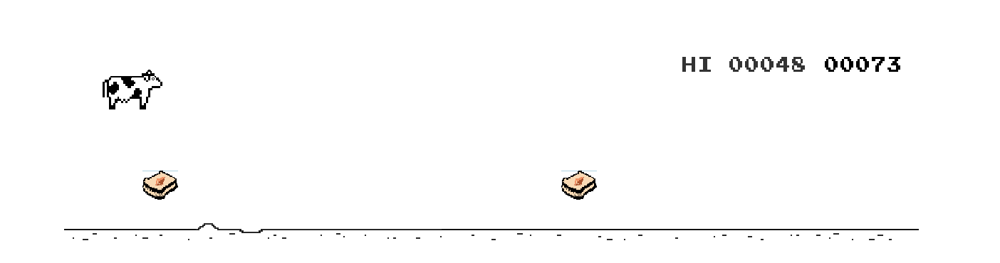

## Cow Runner Game - React

The trex runner game extracted from chrome offline error page, but with less dinosaurs and more Cows!

<p align="center">
  
</p>

This project is a typescript library that provides `CowGame` as a react component.

Changes over the original:
* Broken down into smaller entities (see `src/game/model`)
* Converted into typescript project
* The game has ben wrapped into a React component
* The React component is exported as a library
* Integrated with webpack. You can build the HTML page or run it in dev mode

> 🏗 Pending to add the sprites and styles for the cow game.

## Install dependencies
```bash
yarn
```

## Run dev browser
```bash
yarn start
```

## Build library
```bash
yarn build
```

## Build web
```bash
yarn build:web
```
